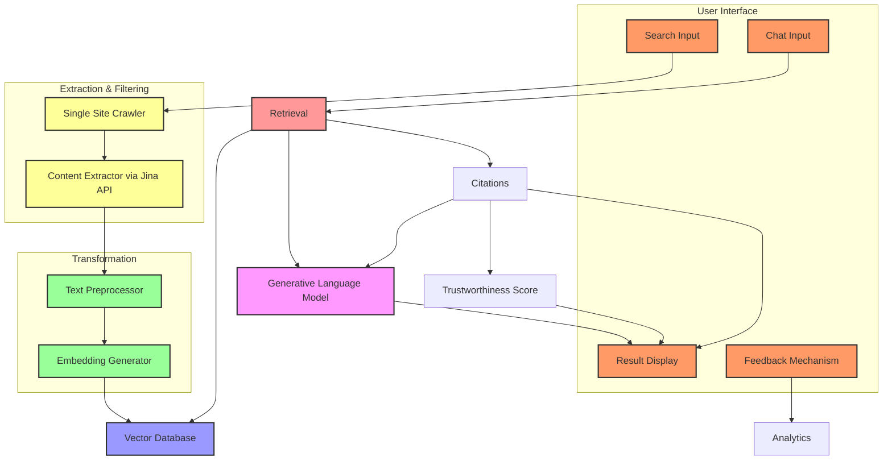

# ADR-001 Initial Architecture

**Status:** Accepted

**Authors:**

- Mithran Mohanraj

## Context

According to P0, LLAMASEARCH is:

FOR students, researchers, and professionals

WHO want to get information from a website privately,

The LLAMASEARCH is a specialized search engine

THAT allows the user to specify what website to search for information in to provide them with a relevant summarized response to their query, and some of the additional features that include are: having an audio file option of the summary/answer content, citation and highlighting where the information came from, ability to download the chat history, asking the user to rate the application and give a suggestion, and lastly a website rating system, which will rate if the website is reliable.

UNLIKE ChatGPT Search

OUR PRODUCT respects user privacy and gives more accurate and relevant responses.

But we are yet to develop a concrete implementation plan. This ADR hopes to address that.

## Decision

To give the team a clearer picture of what we are developing, I propose the following architecture.

## Explanation

There are three types of inputs from the user we must handle.

First, there is the search input, where the user chooses what website they want to scrape. This will trigger a workflow in which our crawler will index the entire website (within reason). Then we will extract the content from the pages the crawler indexed and use the Jina API (https://r.jina.ai/your-url-here) to save it in a markdown format. Finally, we will transform the markdown documents into vectors and store it in an in-memory vector database of our choosing.

Second, there is the chat input. The chat input depends on the search input, meaning users cannot start a chat until they complete a search. When a user sends a chat message, it triggers a workflow that converts the message into a vector and performs a cosine similarity search against all vectors in the database. The top-K similar vectors will correspond to markdown chunks containing relevant information, which will be used as citations. These chunks will be appended to the user's message before prompting Llama for Retrieval-Augmented Generation (RAG). Additionally, the source URLs of the retrieved chunks will be queried against a trustworthiness service (implementation details are still unclear) to obtain a trustworthiness score for each citation. The UI will then display the generated response from Llama, along with the citations and their trustworthiness scores.

Third is the feedback input. We will trigger this input when the user completes their first chat to ask them how their experience was. We can develop an analytics service to measure user engagement throughout the application workflow, and also store this feedback.

## Review Triggers

- We begin developing a feature and realize it is too costly to complete within the semester
- We find that this design is not modular enough
