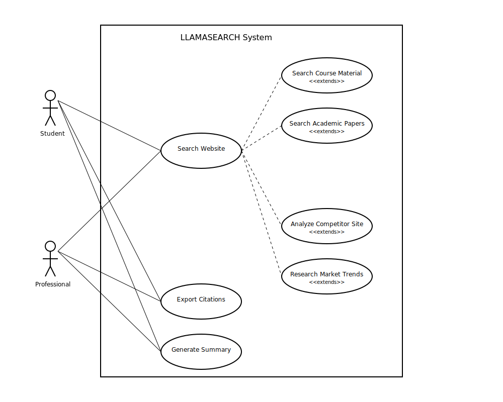
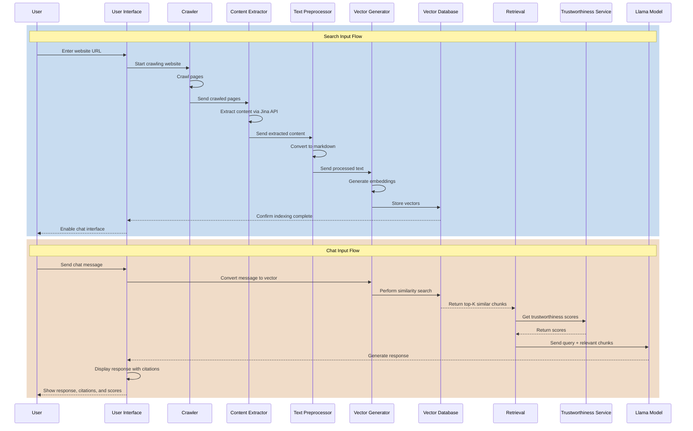
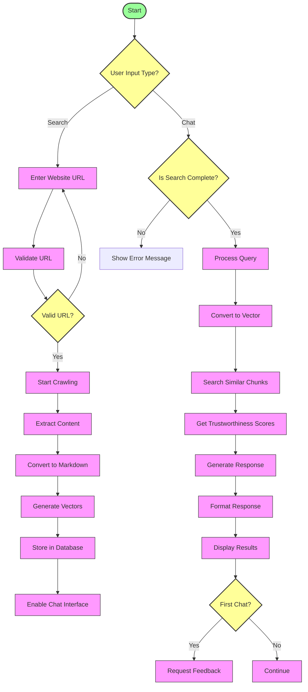
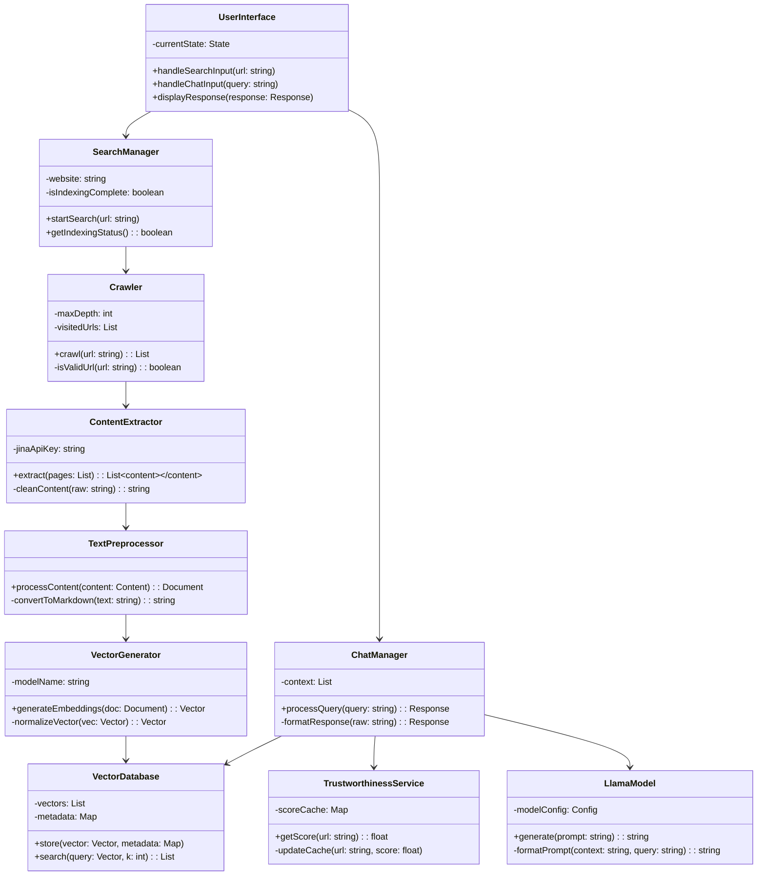

# ADR-002 Architecture Refinement
**Status:** Accepted

**Authors:**

- Mithran Mohanraj

## Context

For P1, we need to begin the creation of concrete UML diagrams describing the behavior and business logic of LlamaSearch.

## Decision

In order to give the team a clearer picture of LlamaSearch's business logic, I designed the following UML diagrams. I propose that we loosely follow the implementation they describe.

### Use Case Digagram

### Sequence Diagram

### Activity Diagram

### Class Diagram

## Explanation

These diagrams were derived from the initial architecture diagram in [ADR-001](./001-initial-architecture.md). They are not comprehensive, and will need revisions in future ADRs.

## Review Triggers
- We begin developing a feature according to a diagram and discover it is not feasible
- We find flaws in the design described by the diagrams
