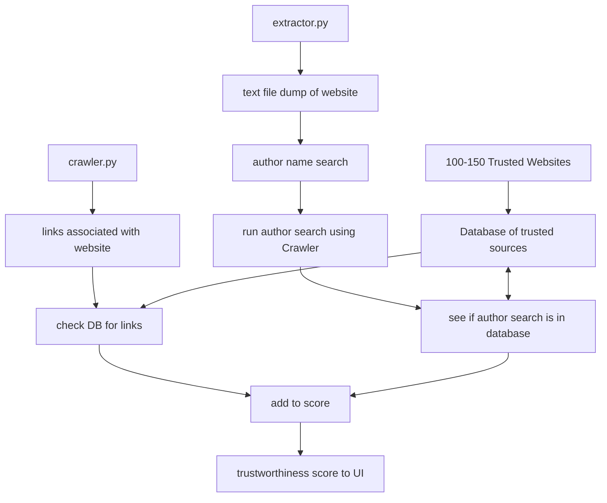

# ADR-003 Trustworthiness Score System
**Status:** In Review

**Authors:**

- Leo Angulo

## Context

For the Trustworthiness score feature we need to develop a system before implementing code for the feature.

## Decision

To help with development, I decided to create a system mock up that represents how the trustworthiness score would be implemented and created specifications on parts
that still need a system to be created for it.

### System Architecture

## Explanation
- The extractor.py and crawler.py is from the current system and is already developed to give out the outputs of associated links and a text file dump.
- The database represents a file with 100-150 trusted websites that will be used to compare if the source is trustworthy.
- Crawler.py will have a list of links and that will be compared to the database to see if any of the links are in the database and will add to the score.
- Extractor.py will create a text file of the website dump so it needs complete an author name search, run the authors names through crawler in some way, and the associated links will need to be searched in the database to add to score.
- How to add to score will be decided later it would be best if we know how to do the search first. Some ideas including counting how many sources relate, how many reliable authors, etc when determing the score added.

## Specifications
- Finding a list of 100-150 trusted website sources.
- Figuring out how to do the author name search through the text file.
- How we should run the author names in crawler, like a Google Search?
- Adding score implementation and specifications.

## Review Triggers
- We cannot complete a author search through the given data
- We find flaws in the design described by the diagrams