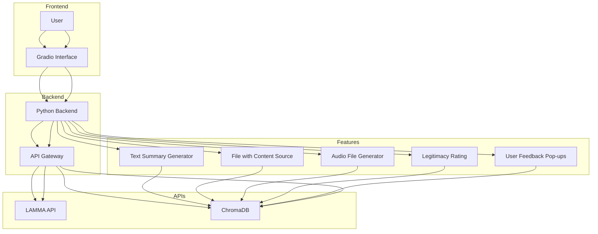

# Project Overview - LLAMASEARCH

LLAMASEARCH is an advanced search engine designed to help users find relevant content and answers based on a provided website link. Users can ask questions, and the application will use the LLAMA LLM to generate answers based on the website’s content.

To enhance the user experience, LLAMASEARCH will offer the following additional features:

    1. Text-based answers generated by the model.
    2. A file containing citations and highlights of the content that answers the question.
    3. An audio file of the generated answer.
    4. A 1-10 rating system for evaluating the trustworthiness and legitimacy of the website/source.
    5. Pop-up feature to ask for feedback and suggestions.

# Architecture

