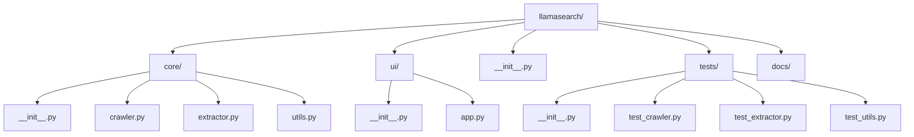

# Sprint 1

## File Structure

## Tasks

1. Setup Gradio

   1. pip install gradio and add to pyproject.toml
   2. Create llamasearch/ui folder
   3. Create a hello-world ui in app.py
2. Begin Webscraping

   1. Write specifications for crawler.py
   2. Write specifications for extractor.py
   3. Write specfications for utils.py
   4. Write tests for crawler.py
   5. Write tests for extractor.py
   6. Write tests for utils.py
   7. Write crawler.py code
   8. Write extract.py code
   9. Write utils.py code
3. Integrate core into ui (app.py)

   1. Create "Search" button calls crawler.py
   2. Create "Scrape" button that calls extract.py and passes output of crawler.py
   3. Aesthetics for ui
