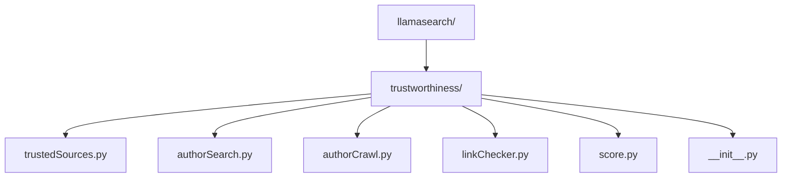

# Sprint 2

## File Structure

## Tasks

1. Create Database

   1. Create a folder under llamasearch/ called trustworthiness
   2. Find 50-100 website sources that can be considered reliable sources for a wide range of topics
   3. Store as a python file whatever is the most convenient to read from

2. Creating link checker

   1. Create a file linkChecker.py that will communicate with the database trustedSources.py
   2. linkChecker.py should recieve a list of links and be able to compare to the database to identify any relative matches.
   3. linkChecker.py is responsible for checking the links from the output of both crawler.py and authorCrawl.py
   4. linkChecker.py should be able to give a count or a boolean indicating that the associated links are found in the database.

3. Create author searching

   1. authorSearch.py should be able to look through the output file from extractor.py and to find author names.
   2. authorCrawl.py should be able to run a search from the output of authorSearch.py to find links associated with the extracted authors.
   3. authorCrawl.py should output a text file containing the links associated to the authors found.
   4. authorCrawl.py should extend from the results of authorSearch.py

4. Create trustworthiness score protocol 

    1. score.py should be able to interpret the data from linkChecker.py
    2. score.py needs to have a protocol determining how trustworthy the sources are from the linkChecker.py
    3. score.py needs to output a score that app.py will be able to interpret.

5. Execution of Code

   1. The placement of the execution file still needs to be determined.
   2. Everything is mainly ran through linkChecker.py and then score.py or methods from it will be called to give the final score to the UI